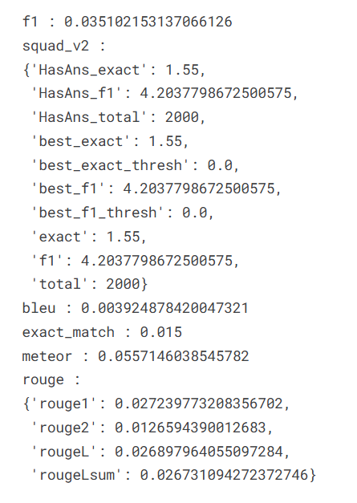
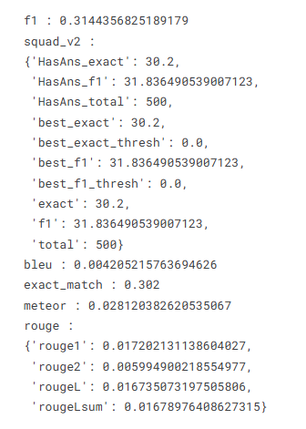

# CS613-NLP Team-1 Telugu Assignment 3

## Team Members

1. **Bhavik Patel (22110047)** : Fine-tuned the model on SST-2 dataset and evaluated the model.
2. **Guntas Singh Saran (22110089)** : Helped in fine-tuning the model on SQuAD dataset and evalueated the model.
3. **Hitesh Kumar (22110098)** : Fine-tuned the model on SQuAD dataset and SST-2 dataset.
4. **Ruchit Jagodara (22110102)** : Evaluated fine tuned model on SQuAD dataset.
5. **Jinil Patel (22110184)** : Evaluated fine tuned model on SST-2 dataset and helped in fine-tuning of SST-2 dataset.

## Task - 1

### Project: Fine-Tuning and Evaluation of the Llama 3.2-1B/Gemma Model

---

#### **1. Model Selection and Parameter Calculation**

- **Selected Model:** [Llama 3.2-1B](https://huggingface.co/meta-llama/Llama-3.2-1B)
- **Parameter Calculation:**  
  
  - **Calculated Parameters:** `1,235,814,400`
  - **Reported Parameters (in paper):** `1.23 Billion` 
    

        
    

  **Comparison:** Since the paper does not explicitly provide the exact number of parameters for the Llama 3.2-1B, we compare the approximate parameter count mentioned in the paper with the parameters calculated through the code. Upon calculation, the parameters are approximately similar, validating the correctness of our implementation and alignment with the model architecture described in the paper.

---

#### **2. Fine-Tuning Process**

- **Datasets:**  
  - **Classification Task:** SST-2 (Sentiment Analysis)  
  - **Question-Answering Task:** SQuAD (Stanford Question Answering Dataset)

- **Train-Test Split:**  
  - Split ratio: 80% train, 20% test  
  - Sampling: Stratified sampling

- **Fine-Tuning Process:**  
  1. Classification Task: SST-2  
     - Loaded pre-trained Llama 3.2-1B using AutoModelForSequenceClassification.

     

        
     

     

        
     

      
     
    2. Question-Answering Task: SQuAD  
    - Loaded pre-trained Llama 3.2-1B using AutoModelCausalLM and added custom output layer for the respective task.
     

        
     

     

        
     

---

#### **3. Evaluation Metrics**

##### **Classification (SST-2)**  
- Metrics:  
  - **Accuracy**: Measures overall correctness.  
  - **Precision**: Measures the ratio of correctly predicted positive observations to the total predicted positives.  
  - **Recall**: Measures the ratio of correctly predicted positive observations to the all positives in the dataset.  
  - **F1 Score**: Harmonic mean of precision and recall.  

  | **Pretrained (Zero-shot)** | **Fine-tuned**       |
  |--------------------|------------------------|
  | |  |

##### **Question-Answering (SQuAD)**  
- Metrics:  
  - **squad_v2**: Performance on unanswerable questions.  
  - **F1 Score**: Measures overlap between prediction and ground truth.  
  - **METEOR, BLEU, ROUGE**: Evaluate textual similarity.  
  - **Exact Match**: Measures strict correctness.

  | **Pretrained (Zero-shot)** | **Fine-tuned**       |
  |--------------------|------------------------|
  | |  |

---

#### **4. Model Parameters After Fine-Tuning**

> **Note:** In fine-tuning we are adding a task specific head to the output of the pre-trained `Llama 3.2-1B model`(base model). While importing 

  1. Classification Task: SST-2 
  
  - Pre-trained model parameters: `1,235,814,400`  
  - Fine-tuned model parameters: `1,235,818,496`  
  

    
  

  
  2. Question-Answering Task: SQuAD  
  
  - Pre-trained model parameters: `1,235,814,400`  
  - Fine-tuned model parameters: `1,235,818,498`  
  

    
  

  - **Conclusion:** The total number of parameters in the pre-trained model and fine-tuned model are different due to the addition of task-specific layer. The base model parameters remain the same, and the additional parameters are due to the task-specific head added during fine-tuning and are only trained on the task-specific dataset.

---

#### **5. Model Upload to Hugging Face**

Fine-tuned models are uploaded to the 🤗 Hub: 
  - [Llama 3.2-1B Fine-Tuned on SST-2](https://huggingface.co/bp03/Classification_SST2_Llama_3.2_1B_Model/tree/main)
  - [Llama 3.2-1B Fine-Tuned on SQuAD](https://huggingface.co/bp03/QuestionAnswering_SQUADV2_Llamma_3.2_1B/tree/main)

---

#### **6. Analysis of Results**

- **Higher Scores in Fine-Tuned Models:**  
  - Fine-tuning improves model understanding by adapting it to specific tasks and datasets.  
  - Metrics such as F1 Score and Exact Match are significantly higher due to task-specific training.  

- **Understanding Parameter Behavior:**  
  The number of parameters doesn't change post-fine-tuning. However, fine-tuning modifies weight distributions within the same parameter space, leading to improved task performance.

- **Zero-Shot vs. Fine-Tuned Performance:**  
  - Zero-shot models generalize poorly on specialized tasks like sentiment analysis or question answering.  
  - Fine-tuned models excel due to exposure to task-specific examples during training.

---